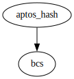

# Module `0x1::aptos_hash`

Cryptographic hashes:
- Keccak-256: see https://keccak.team/keccak.html

In addition, SHA2-256 and SHA3-256 are available in <code>std::hash</code>. Note that SHA3-256 is a variant of Keccak: it is
NOT the same as Keccak-256.

Non-cryptograhic hashes:
- SipHash: an add-rotate-xor (ARX) based family of pseudorandom functions created by Jean-Philippe Aumasson and Daniel J. Bernstein in 2012

-  [Function `sip_hash`](#0x1_aptos_hash_sip_hash)
-  [Function `sip_hash_from_value`](#0x1_aptos_hash_sip_hash_from_value)
-  [Function `keccak256`](#0x1_aptos_hash_keccak256)
-  [Specification](#@Specification_0)
    -  [Function `sip_hash`](#@Specification_0_sip_hash)
    -  [Function `sip_hash_from_value`](#@Specification_0_sip_hash_from_value)

<pre><code><b>use</b> <a href="../../move-stdlib/doc/bcs.md#0x1_bcs">0x1::bcs</a>;
</code></pre>

Show all the modules that "aptos_hash" depends on directly or indirectly

Show all the modules that depend on "aptos_hash" directly or indirectly

## Function `sip_hash`

<pre><code><b>public</b> <b>fun</b> <a href="hash.md#0x1_aptos_hash_sip_hash">sip_hash</a>(bytes: <a href="../../move-stdlib/doc/vector.md#0x1_vector">vector</a>&lt;u8&gt;): u64
</code></pre>

Implementation

<pre><code><b>native</b> <b>public</b> <b>fun</b> <a href="hash.md#0x1_aptos_hash_sip_hash">sip_hash</a>(bytes: <a href="../../move-stdlib/doc/vector.md#0x1_vector">vector</a>&lt;u8&gt;): u64;
</code></pre>

Show all the functions that "sip_hash" calls

Show all the functions that call "sip_hash"

## Function `sip_hash_from_value`

<pre><code><b>public</b> <b>fun</b> <a href="hash.md#0x1_aptos_hash_sip_hash_from_value">sip_hash_from_value</a>&lt;MoveValue&gt;(v: &MoveValue): u64
</code></pre>

Implementation

<pre><code><b>public</b> <b>fun</b> <a href="hash.md#0x1_aptos_hash_sip_hash_from_value">sip_hash_from_value</a>&lt;MoveValue&gt;(v: &MoveValue): u64 {
    <b>let</b> bytes = <a href="../../move-stdlib/doc/bcs.md#0x1_bcs_to_bytes">bcs::to_bytes</a>(v);

    <a href="hash.md#0x1_aptos_hash_sip_hash">sip_hash</a>(bytes)
}
</code></pre>

Show all the functions that "sip_hash_from_value" calls

Show all the functions that call "sip_hash_from_value"

## Function `keccak256`

<pre><code><b>public</b> <b>fun</b> <a href="hash.md#0x1_aptos_hash_keccak256">keccak256</a>(bytes: <a href="../../move-stdlib/doc/vector.md#0x1_vector">vector</a>&lt;u8&gt;): <a href="../../move-stdlib/doc/vector.md#0x1_vector">vector</a>&lt;u8&gt;
</code></pre>

Implementation

<pre><code><b>native</b> <b>public</b> <b>fun</b> <a href="hash.md#0x1_aptos_hash_keccak256">keccak256</a>(bytes: <a href="../../move-stdlib/doc/vector.md#0x1_vector">vector</a>&lt;u8&gt;): <a href="../../move-stdlib/doc/vector.md#0x1_vector">vector</a>&lt;u8&gt;;
</code></pre>

Show all the functions that "keccak256" calls

Show all the functions that call "keccak256"

## Specification

### Function `sip_hash`

<pre><code><b>public</b> <b>fun</b> <a href="hash.md#0x1_aptos_hash_sip_hash">sip_hash</a>(bytes: <a href="../../move-stdlib/doc/vector.md#0x1_vector">vector</a>&lt;u8&gt;): u64
</code></pre>

<pre><code><b>pragma</b> opaque;
</code></pre>

### Function `sip_hash_from_value`

<pre><code><b>public</b> <b>fun</b> <a href="hash.md#0x1_aptos_hash_sip_hash_from_value">sip_hash_from_value</a>&lt;MoveValue&gt;(v: &MoveValue): u64
</code></pre>

<pre><code><b>pragma</b> opaque;
</code></pre>

[move-book]: https://move-language.github.io/move/introduction.html
